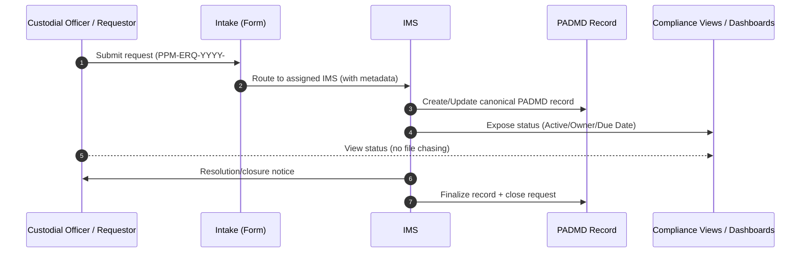
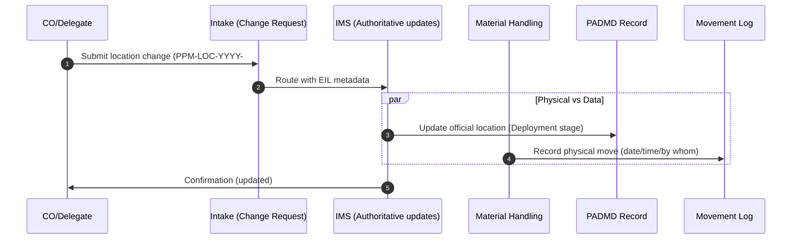
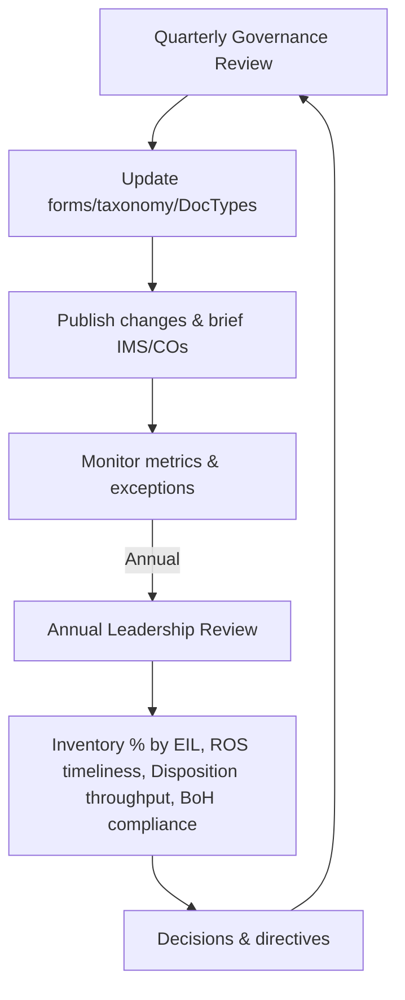
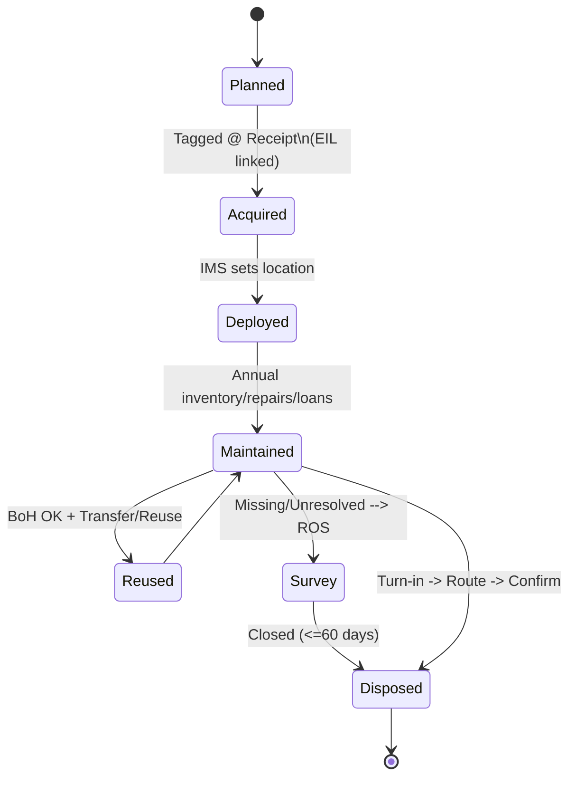

# NX Information Flow – Mermaid Diagrams
Date: September 05, 2025  
Prepared by: James Wilkinson  
Role: NX/PPM Supervisor – Pittsburgh VA  

---

## PADMD Lifecycle – Information Flow
```mermaid
flowchart LR
    P[Planning] --> A[Acquisition] --> D[Deployment] --> M[Maintenance] --> X[Disposition]

    subgraph SG_P[Planning - Data/Controls]
      P1[SEPG record (need/justification)]
      P2[EIL assignment (CO of record)]
      P3[Equipment Committee notes]
      P4[5-year replacement forecast]
      P --> P1 --> P2 --> P3 --> P4
    end

    subgraph SG_A[Acquisition - Data/Controls]
      A1[Requisition/Approval]
      A2[Receiving Event (MH)]
      A3[EE Tagging @ Receipt]
      A4[Link to EIL at tagging]
      A --> A1 --> A2 --> A3 --> A4
    end

    subgraph SG_D[Deployment - Data/Controls]
      D1[Placement record]
      D2[CO Change Request via Intake]
      D3[IMS updates official location]
      D4[Movement log (MH)]
      D --> D1 --> D2 --> D3 --> D4
    end

    subgraph SG_M[Maintenance - Data/Controls]
      M1[Annual Inventory result]
      M2[Exceptions & Follow-ups]
      M3[Loan Registry entries]
      M4[Bill-of-Health (BoH) for reuse]
      M --> M1 --> M2 --> M3 --> M4
    end

    subgraph SG_X[Disposition - Data/Controls]
      X1[Turn-in case]
      X2[Inspections: OIT/Biomed/FMS]
      X3[ROS as required]
      X4[Excess/Unicor/Recycle route]
      X5[Final disposal confirmation]
      X --> X1 --> X2 --> X3 --> X4 --> X5
    end
```

## Request Intake – Execution Flow


## Location Change – No Silent Moves


## Annual Inventory Flow
```mermaid
flowchart TD
    S[Start Inventory Cycle] --> S1[Generate EIL Due List]
    S1 --> S2[Assign IMS & Schedule]
    S2 --> S3[Scan & Verify EE against system]
    S3 -->|Match| S4[Mark Verified]
    S3 -->|Not Found/Discrepancy| S5[Exception Record]

    S5 --> S6[Follow-up Actions]\n(Search, CO inquiry, MH trace)
    S6 --> S7{Resolved?}
    S7 -->|Yes| S4
    S7 -->|No| S8[Initiate ROS (PPM-ROS-YYYY-####)]

    S4 --> S9[Compute EIL Accuracy %]
    S9 -->|>=95%| S10[Close Inventory for EIL]
    S9 -->|<95%| S11[Schedule Re-check ≤ 6 months]

    S10 --> E[End]
    S11 --> E
```

## Reports of Survey (ROS) Workflow
```mermaid
flowchart LR
    I[Initiate ROS (PPM-ROS-YYYY-####)] --> A[Assemble Case File]
    A --> Q[AO/Board Review & Investigation]
    Q --> D{Determination}
    D -->|Negligence found| R1[Assess Liability/Recovery]
    D -->|No negligence| R2[Document Findings]
    R1 --> C[Close ROS ≤ 60 days]
    R2 --> C

    subgraph Visibility & Controls
      V1[Per-IMS ROS View (status/stage)]
      V2[Auto reminders: 30/45/60 day]
      V3[Leadership summary widget]
    end
    I -.-> V1
    Q -.-> V2
    C -.-> V3
```

## Disposition Workflow
```mermaid
flowchart TD
    TI[Turn-in Request (PPM-TRN-YYYY-####)] --> CMR[CMR/Source Proof Attached]
    CMR --> INSP[Inspections: OIT/Biomed/FMS]
    INSP -->|Reusable| BOH[BoH required (shop submits)]
    INSP -->|Not reusable| RTE2[Recycle/Disposal]
    BOH --> RTE1[Excess/Reuse Channel]
    RTE1 --> CONF[Final Confirmation & Update]
    RTE2 --> CONF

    subgraph Custody Chain
      RC[MH Receives/Staging]
      MV[MH Physical Transfer]
    end
    TI --> RC --> MV
    MV --> CONF

    CONF --> CL[Close Disposition Case]\n(attach confirmations)
```

## Contingency Operations
```mermaid
flowchart LR
    O[Outage Trigger] --> ET[Email Templates Enforced]
    ET -->|Subject uses Unique ID| ID[[PPM-TYPE-YYYY-####]]
    ET --> EB[Body fields: EIL, CO, IMS, desc]
    ID --> U[Uber-Tracker Row Created]
    EB --> U

    U --> R{System Restored?}
    R -->|No| U
    R -->|Yes| MIG[Reconcile into PADMD\n(use same Unique ID)]
    MIG --> CL[Mark tracker row Reconciled]
```

## Governance Cadence


## Asset State Over Time

